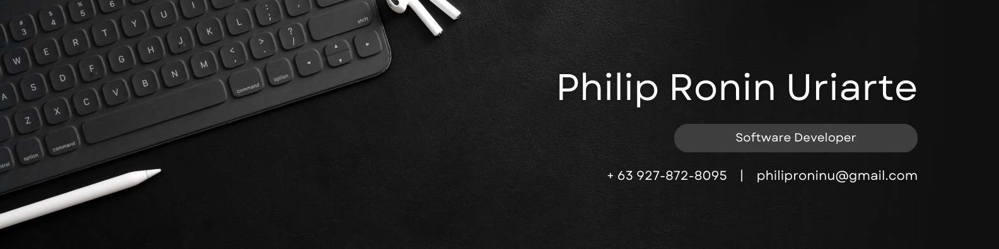

<h1 align="center">
  Hi, I'm Philip 👋
</h1>

 
  A 3rd-year Computer Science Student at De La Salle University - Dasmariñas  
  I'm aspring to become a Game/Application Developer

  ────────────────────────

<h3 align="center">
  Languages & Tools
    
  
  
  
  
  
  
  
  
  
  
</h3>

  ────────────────────────

<h3 align="center">
  Interested in Learning
    
  
  
  
</h3>
